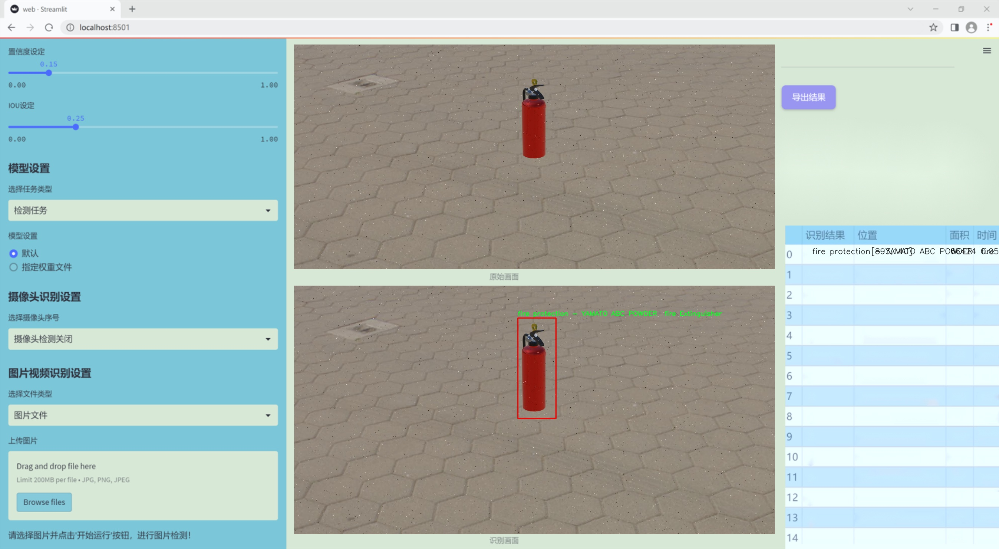
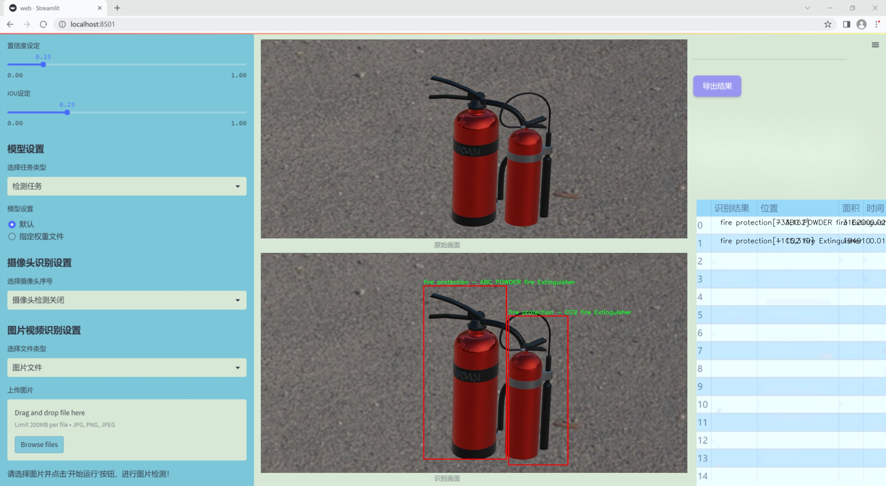
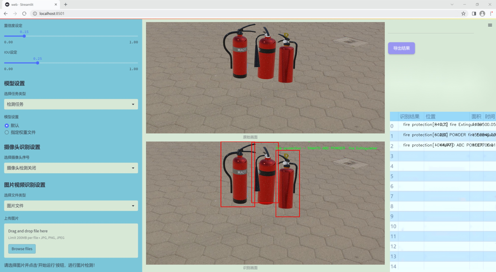
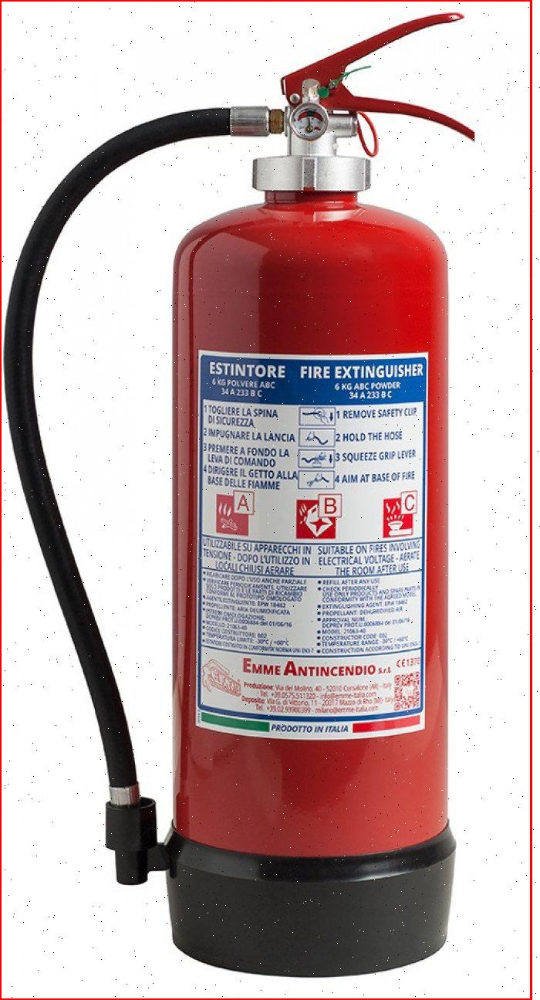
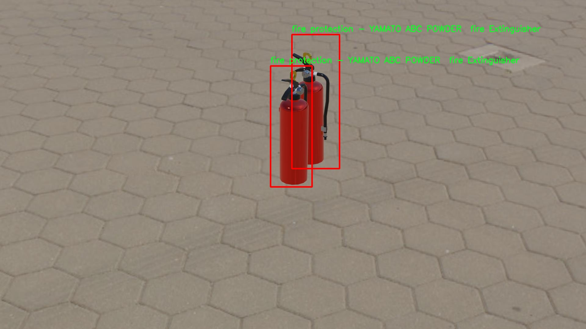
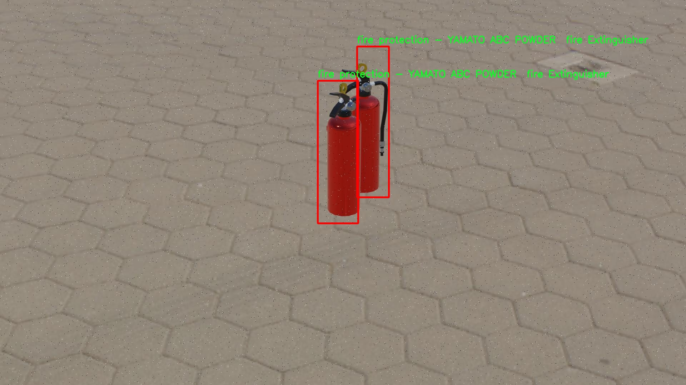
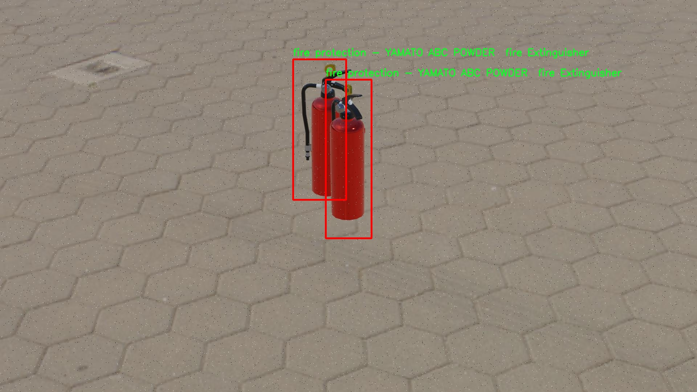

# 改进yolo11-MSBlock等200+全套创新点大全：灭火器检测系统源码＆数据集全套

### 1.图片效果展示







##### 项目来源 **[人工智能促进会 2024.10.28](https://kdocs.cn/l/cszuIiCKVNis)**

注意：由于项目一直在更新迭代，上面“1.图片效果展示”和“2.视频效果展示”展示的系统图片或者视频可能为老版本，新版本在老版本的基础上升级如下：（实际效果以升级的新版本为准）

  （1）适配了YOLOV11的“目标检测”模型和“实例分割”模型，通过加载相应的权重（.pt）文件即可自适应加载模型。

  （2）支持“图片识别”、“视频识别”、“摄像头实时识别”三种识别模式。

  （3）支持“图片识别”、“视频识别”、“摄像头实时识别”三种识别结果保存导出，解决手动导出（容易卡顿出现爆内存）存在的问题，识别完自动保存结果并导出到tempDir中。

  （4）支持Web前端系统中的标题、背景图等自定义修改。

  另外本项目提供训练的数据集和训练教程,暂不提供权重文件（best.pt）,需要您按照教程进行训练后实现图片演示和Web前端界面演示的效果。

### 2.视频效果展示

[2.1 视频效果展示](https://www.bilibili.com/video/BV1ddSWY4EKV/)

### 3.背景

研究背景与意义

随着城市化进程的加快和工业化水平的提升，火灾事故的发生频率逐年上升，给人民生命财产安全带来了严重威胁。有效的火灾预防和灭火措施成为了社会各界关注的焦点。灭火器作为一种重要的消防设备，其在火灾初期的快速反应能力至关重要。然而，传统的灭火器检查和维护方式往往依赖人工巡检，效率低下且容易出现遗漏。因此，基于计算机视觉技术的自动化灭火器检测系统应运而生，成为提升消防安全管理水平的重要手段。

本研究旨在基于改进的YOLOv11模型，构建一个高效的灭火器检测系统。YOLO（You Only Look Once）系列模型以其快速的检测速度和较高的准确率在目标检测领域取得了显著的成果。通过对YOLOv11的改进，我们希望能够在复杂环境中实现对不同类型灭火器的准确识别与定位。具体而言，本项目将使用包含242张图像的数据集，涵盖三类灭火器：ABC干粉灭火器、CO2灭火器和YAMATO ABC干粉灭火器。这些数据的多样性和丰富性为模型的训练提供了良好的基础。

通过对灭火器的自动检测与识别，不仅可以提高灭火器的管理效率，还能在火灾发生时提供及时的响应信息，帮助人们迅速找到合适的灭火器进行自救。同时，该系统的应用还可以为消防安全教育提供支持，增强公众的消防安全意识。综上所述，基于改进YOLOv11的灭火器检测系统的研究，不仅具有重要的理论意义，还有助于提升实际消防安全管理水平，为社会的安全稳定做出贡献。

### 4.数据集信息展示

##### 4.1 本项目数据集详细数据（类别数＆类别名）

nc: 3
names: ['fire protection - ABC POWDER fire Extinguisher', 'fire protection - CO2 fire Extinguisher', 'fire protection - YAMATO ABC POWDER  fire Extinguisher']


该项目为【目标检测】数据集，请在【训练教程和Web端加载模型教程（第三步）】这一步的时候按照【目标检测】部分的教程来训练

##### 4.2 本项目数据集信息介绍

本项目数据集信息介绍

本项目所使用的数据集名为“fire extinguisher”，旨在为改进YOLOv11的灭火器检测系统提供强有力的支持。该数据集专注于灭火器的检测与分类，包含了三种主要类别，分别是“fire protection - ABC POWDER fire Extinguisher”、“fire protection - CO2 fire Extinguisher”以及“fire protection - YAMATO ABC POWDER fire Extinguisher”。这些类别的选择不仅考虑到了灭火器的广泛应用性，还涵盖了不同类型灭火器的特性与功能，为系统的训练提供了多样化的样本。

数据集中每一类灭火器的图像均经过精心挑选，确保在不同环境、角度和光照条件下均能有效地反映出灭火器的外观特征。这种多样性使得模型在训练过程中能够学习到更为丰富的特征，从而提高其在实际应用中的识别准确率。此外，数据集中的图像标注信息详细，确保每个样本的类别信息清晰明了，便于模型进行有效的学习与分类。

通过对“fire extinguisher”数据集的深入分析与应用，本项目旨在提升YOLOv11在灭火器检测任务中的性能，进而为火灾安全管理提供技术支持。该数据集不仅为模型的训练提供了坚实的基础，也为后续的模型优化与应用奠定了良好的数据基础。随着项目的深入，预计将进一步扩展数据集的规模与多样性，以应对更复杂的检测场景和需求，推动灭火器检测技术的不断进步。










### 5.全套项目环境部署视频教程（零基础手把手教学）

[5.1 所需软件PyCharm和Anaconda安装教程（第一步）](https://www.bilibili.com/video/BV1BoC1YCEKi/?spm_id_from=333.999.0.0&vd_source=bc9aec86d164b67a7004b996143742dc)


[5.2 安装Python虚拟环境创建和依赖库安装视频教程（第二步）](https://www.bilibili.com/video/BV1ZoC1YCEBw?spm_id_from=333.788.videopod.sections&vd_source=bc9aec86d164b67a7004b996143742dc)

### 6.改进YOLOv11训练教程和Web_UI前端加载模型教程（零基础手把手教学）

[6.1 改进YOLOv11训练教程和Web_UI前端加载模型教程（第三步）](https://www.bilibili.com/video/BV1BoC1YCEhR?spm_id_from=333.788.videopod.sections&vd_source=bc9aec86d164b67a7004b996143742dc)


按照上面的训练视频教程链接加载项目提供的数据集，运行train.py即可开始训练



     Epoch   gpu_mem       box       obj       cls    labels  img_size
     1/200     20.8G   0.01576   0.01955  0.007536        22      1280: 100%|██████████| 849/849 [14:42<00:00,  1.04s/it]
               Class     Images     Labels          P          R     mAP@.5 mAP@.5:.95: 100%|██████████| 213/213 [01:14<00:00,  2.87it/s]
                 all       3395      17314      0.994      0.957      0.0957      0.0843

     Epoch   gpu_mem       box       obj       cls    labels  img_size
     2/200     20.8G   0.01578   0.01923  0.007006        22      1280: 100%|██████████| 849/849 [14:44<00:00,  1.04s/it]
               Class     Images     Labels          P          R     mAP@.5 mAP@.5:.95: 100%|██████████| 213/213 [01:12<00:00,  2.95it/s]
                 all       3395      17314      0.996      0.956      0.0957      0.0845

     Epoch   gpu_mem       box       obj       cls    labels  img_size
     3/200     20.8G   0.01561    0.0191  0.006895        27      1280: 100%|██████████| 849/849 [10:56<00:00,  1.29it/s]
               Class     Images     Labels          P          R     mAP@.5 mAP@.5:.95: 100%|███████   | 187/213 [00:52<00:00,  4.04it/s]
                 all       3395      17314      0.996      0.957      0.0957      0.0845


###### [项目数据集下载链接](https://kdocs.cn/l/cszuIiCKVNis)

### 7.原始YOLOv11算法讲解

YOLOv11是Ultralytics推出的YOLO系列最新版本，专为实现尖端的物体检测而设计。其架构和训练方法上进行了重大改进，使之不仅具备卓越的准确性和处理速度，还在计算效率上实现了一场革命。得益于其改进的主干和颈部架构，YOLOv11在特征提取和处理复杂任务时表现更加出色。在2024年9月27日，Ultralytics通过长达九小时的在线直播发布这一新作，展示了其在计算机视觉领域的革新。

YOLOv11通过精细的架构设计和优化训练流程，在保持高精度的同时，缩减了参数量，与YOLOv8m相比减少了22%的参数，使其在COCO数据集上的平均准确度（mAP）有所提升。这种效率的提高使YOLOv11非常适合部署在各种硬件环境中，包括边缘设备、云计算平台以及支持NVIDIA GPU的系统，确保在灵活性上的优势。

该模型支持广泛的任务，从对象检测、实例分割到图像分类、姿态估计和定向对象检测（OBB），几乎覆盖了计算机视觉的所有主要挑战。其创新的C3k2和C2PSA模块提升了网络深度和注意力机制的应用，提高了特征提取的效率和效果。同时，YOLOv11的改进网络结构也使之在复杂视觉任务上得以从容应对，成为各类计算机视觉任务的多功能选择。这些特性令YOLOv11在实施实时物体检测的各个领域中表现出众。
* * *

2024年9月27日，Ultralytics在线直播长达九小时，为YOLO11召开“发布会”

YOLO11 是 Ultralytics YOLO 系列实时物体检测器的最新版本，它以尖端的准确性、速度和效率重新定义了可能性。在之前 YOLO
版本的显著进步的基础上，YOLO11 在架构和训练方法方面进行了重大改进，使其成为各种计算机视觉任务的多功能选择。


##### YOLO11主要特点：

  * 增强的特征提取：YOLO11 采用了改进的主干和颈部架构，增强了特征提取能力，可实现更精确的对象检测和复杂任务性能。
  * 针对效率和速度进行了优化：YOLO11 引入了完善的架构设计和优化的训练流程，可提供更快的处理速度，并在准确度和性能之间保持最佳平衡。
  * 更少的参数，更高的准确度：借助模型设计的进步，YOLO11m 在 COCO 数据集上实现了更高的平均准确度 (mAP)，同时使用的参数比 YOLOv8m 少 22%，从而提高了计算效率，同时又不影响准确度。
  * 跨环境的适应性：YOLO11 可以无缝部署在各种环境中，包括边缘设备、云平台和支持 NVIDIA GPU 的系统，从而确保最大的灵活性。
  * 支持的任务范围广泛：无论是对象检测、实例分割、图像分类、姿势估计还是定向对象检测 (OBB)，YOLO11 都旨在满足各种计算机视觉挑战。

##### 支持的任务和模式

YOLO11 以 YOLOv8 中引入的多功能模型系列为基础，为各种计算机视觉任务提供增强的支持：

Model| Filenames| Task| Inference| Validation| Training| Export  
---|---|---|---|---|---|---  
YOLO11| yolol11n.pt, yolol11s.pt, yolol11m.pt, yolol11x.pt| Detection| ✅| ✅|
✅| ✅  
YOLO11-seg| yolol11n-seg.pt, yolol11s-seg.pt, yolol11m-seg.pt,
yolol11x-seg.pt| Instance Segmentation| ✅| ✅| ✅| ✅  
YOLO11-pose| yolol11n-pose.pt, yolol11s-pose.pt, yolol11m-pose.pt,
yolol11x-pose.pt| Pose/Keypoints| ✅| ✅| ✅| ✅  
YOLO11-obb| yolol11n-obb.pt, yolol11s-obb.pt, yolol11m-obb.pt,
yolol11x-obb.pt| Oriented Detection| ✅| ✅| ✅| ✅  
YOLO11-cls| yolol11n-cls.pt, yolol11s-cls.pt, yolol11m-cls.pt,
yolol11x-cls.pt| Classification| ✅| ✅| ✅| ✅  
  
##### 简单的 YOLO11 训练和推理示例

以下示例适用于用于对象检测的 YOLO11 Detect 模型。

    
    
    from ultralytics import YOLO
    
    # Load a model
    model = YOLO("yolo11n.pt")
    
    # Train the model
    train_results = model.train(
        data="coco8.yaml",  # path to dataset YAML
        epochs=100,  # number of training epochs
        imgsz=640,  # training image size
        device="cpu",  # device to run on, i.e. device=0 or device=0,1,2,3 or device=cpu
    )
    
    # Evaluate model performance on the validation set
    metrics = model.val()
    
    # Perform object detection on an image
    results = model("path/to/image.jpg")
    results[0].show()
    
    # Export the model to ONNX format
    path = model.export(format="onnx")  # return path to exported model

##### 支持部署于边缘设备

YOLO11 专为适应各种环境而设计，包括边缘设备。其优化的架构和高效的处理能力使其适合部署在边缘设备、云平台和支持 NVIDIA GPU
的系统上。这种灵活性确保 YOLO11 可用于各种应用，从移动设备上的实时检测到云环境中的复杂分割任务。有关部署选项的更多详细信息，请参阅导出文档。

##### YOLOv11 yaml文件

    
    
    # Ultralytics YOLO 🚀, AGPL-3.0 license
    # YOLO11 object detection model with P3-P5 outputs. For Usage examples see https://docs.ultralytics.com/tasks/detect
    
    # Parameters
    nc: 80 # number of classes
    scales: # model compound scaling constants, i.e. 'model=yolo11n.yaml' will call yolo11.yaml with scale 'n'
      # [depth, width, max_channels]
      n: [0.50, 0.25, 1024] # summary: 319 layers, 2624080 parameters, 2624064 gradients, 6.6 GFLOPs
      s: [0.50, 0.50, 1024] # summary: 319 layers, 9458752 parameters, 9458736 gradients, 21.7 GFLOPs
      m: [0.50, 1.00, 512] # summary: 409 layers, 20114688 parameters, 20114672 gradients, 68.5 GFLOPs
      l: [1.00, 1.00, 512] # summary: 631 layers, 25372160 parameters, 25372144 gradients, 87.6 GFLOPs
      x: [1.00, 1.50, 512] # summary: 631 layers, 56966176 parameters, 56966160 gradients, 196.0 GFLOPs
    
    # YOLO11n backbone
    backbone:
      # [from, repeats, module, args]
      - [-1, 1, Conv, [64, 3, 2]] # 0-P1/2
      - [-1, 1, Conv, [128, 3, 2]] # 1-P2/4
      - [-1, 2, C3k2, [256, False, 0.25]]
      - [-1, 1, Conv, [256, 3, 2]] # 3-P3/8
      - [-1, 2, C3k2, [512, False, 0.25]]
      - [-1, 1, Conv, [512, 3, 2]] # 5-P4/16
      - [-1, 2, C3k2, [512, True]]
      - [-1, 1, Conv, [1024, 3, 2]] # 7-P5/32
      - [-1, 2, C3k2, [1024, True]]
      - [-1, 1, SPPF, [1024, 5]] # 9
      - [-1, 2, C2PSA, [1024]] # 10
    
    # YOLO11n head
    head:
      - [-1, 1, nn.Upsample, [None, 2, "nearest"]]
      - [[-1, 6], 1, Concat, [1]] # cat backbone P4
      - [-1, 2, C3k2, [512, False]] # 13
    
      - [-1, 1, nn.Upsample, [None, 2, "nearest"]]
      - [[-1, 4], 1, Concat, [1]] # cat backbone P3
      - [-1, 2, C3k2, [256, False]] # 16 (P3/8-small)
    
      - [-1, 1, Conv, [256, 3, 2]]
      - [[-1, 13], 1, Concat, [1]] # cat head P4
      - [-1, 2, C3k2, [512, False]] # 19 (P4/16-medium)
    
      - [-1, 1, Conv, [512, 3, 2]]
      - [[-1, 10], 1, Concat, [1]] # cat head P5
      - [-1, 2, C3k2, [1024, True]] # 22 (P5/32-large)
    
      - [[16, 19, 22], 1, Detect, [nc]] # Detect(P3, P4, P5)
    

**YOLO11和YOLOv8 yaml文件的区别**


##### 改进模块代码

  * C3k2 

    
    
    class C3k2(C2f):
        """Faster Implementation of CSP Bottleneck with 2 convolutions."""
    
        def __init__(self, c1, c2, n=1, c3k=False, e=0.5, g=1, shortcut=True):
            """Initializes the C3k2 module, a faster CSP Bottleneck with 2 convolutions and optional C3k blocks."""
            super().__init__(c1, c2, n, shortcut, g, e)
            self.m = nn.ModuleList(
                C3k(self.c, self.c, 2, shortcut, g) if c3k else Bottleneck(self.c, self.c, shortcut, g) for _ in range(n)
            )

C3k2，它是具有两个卷积的CSP（Partial Cross Stage）瓶颈架构的更快实现。

**类继承：**

  * `C3k2`继承自类`C2f`。这表明`C2f`很可能实现了经过修改的基本CSP结构，而`C3k2`进一步优化或修改了此结构。

**构造函数（`__init__`）：**

  * `c1`：输入通道。

  * `c2`：输出通道。

  * `n`：瓶颈层数（默认为1）。

  * `c3k`：一个布尔标志，确定是否使用`C3k`块或常规`Bottleneck`块。

  * `e`：扩展比率，控制隐藏层的宽度（默认为0.5）。

  * `g`：分组卷积的组归一化参数或组数（默认值为 1）。

  * `shortcut`：一个布尔值，用于确定是否在网络中包含快捷方式连接（默认值为 `True`）。

**初始化：**

  * `super().__init__(c1, c2, n, short-cut, g, e)` 调用父类 `C2f` 的构造函数，初始化标准 CSP 组件，如通道数、快捷方式、组等。

**模块列表（`self.m`）：**

  * `nn.ModuleList` 存储 `C3k` 或 `Bottleneck` 模块，具体取决于 `c3k` 的值。

  * 如果 `c3k` 为 `True`，它会初始化 `C3k` 模块。`C3k` 模块接收以下参数：

  * `self.c`：通道数（源自 `C2f`）。

  * `2`：这表示在 `C3k` 块内使用了两个卷积层。

  * `shortcut` 和 `g`：从 `C3k2` 构造函数传递。

  * 如果 `c3k` 为 `False`，则初始化标准 `Bottleneck` 模块。

`for _ in range(n)` 表示将创建 `n` 个这样的块。

**总结：**

  * `C3k2` 实现了 CSP 瓶颈架构，可以选择使用自定义 `C3k` 块（具有两个卷积）或标准 `Bottleneck` 块，具体取决于 `c3k` 标志。

  * C2PSA

    
    
    class C2PSA(nn.Module):
        """
        C2PSA module with attention mechanism for enhanced feature extraction and processing.
    
        This module implements a convolutional block with attention mechanisms to enhance feature extraction and processing
        capabilities. It includes a series of PSABlock modules for self-attention and feed-forward operations.
    
        Attributes:
            c (int): Number of hidden channels.
            cv1 (Conv): 1x1 convolution layer to reduce the number of input channels to 2*c.
            cv2 (Conv): 1x1 convolution layer to reduce the number of output channels to c.
            m (nn.Sequential): Sequential container of PSABlock modules for attention and feed-forward operations.
    
        Methods:
            forward: Performs a forward pass through the C2PSA module, applying attention and feed-forward operations.
    
        Notes:
            This module essentially is the same as PSA module, but refactored to allow stacking more PSABlock modules.
    
        Examples:
            >>> c2psa = C2PSA(c1=256, c2=256, n=3, e=0.5)
            >>> input_tensor = torch.randn(1, 256, 64, 64)
            >>> output_tensor = c2psa(input_tensor)
        """
    
        def __init__(self, c1, c2, n=1, e=0.5):
            """Initializes the C2PSA module with specified input/output channels, number of layers, and expansion ratio."""
            super().__init__()
            assert c1 == c2
            self.c = int(c1 * e)
            self.cv1 = Conv(c1, 2 * self.c, 1, 1)
            self.cv2 = Conv(2 * self.c, c1, 1)
    
            self.m = nn.Sequential(*(PSABlock(self.c, attn_ratio=0.5, num_heads=self.c // 64) for _ in range(n)))
    
        def forward(self, x):
            """Processes the input tensor 'x' through a series of PSA blocks and returns the transformed tensor."""
            a, b = self.cv1(x).split((self.c, self.c), dim=1)
            b = self.m(b)
            return self.cv2(torch.cat((a, b), 1))

`C2PSA` 模块是一个自定义神经网络层，带有注意力机制，用于增强特征提取和处理。

**类概述**

  * **目的：**

  * `C2PSA` 模块引入了一个卷积块，利用注意力机制来改进特征提取和处理。

  * 它使用一系列 `PSABlock` 模块，这些模块可能代表某种形式的位置自注意力 (PSA)，并且该架构旨在允许堆叠多个 `PSABlock` 层。

**构造函数（`__init__`）：**

  * **参数：**

  * `c1`：输入通道（必须等于 `c2`）。

  * `c2`：输出通道（必须等于 `c1`）。

  * `n`：要堆叠的 `PSABlock` 模块数量（默认值为 1）。

  * `e`：扩展比率，用于计算隐藏通道的数量（默认值为 0.5）。

  * **属性：**

  * `self.c`：隐藏通道数，计算为 `int(c1 * e)`。

  * `self.cv1`：一个 `1x1` 卷积，将输入通道数从 `c1` 减少到 `2 * self.c`。这为将输入分成两部分做好准备。

  * `self.cv2`：另一个 `1x1` 卷积，处理后将通道维度恢复回 `c1`。

  * `self.m`：一系列 `PSABlock` 模块。每个 `PSABlock` 接收 `self.c` 通道，注意头的数量为 `self.c // 64`。每个块应用注意和前馈操作。

**前向方法：**

  * **输入：**

  * `x`，输入张量。

  * **操作：**

  1. `self.cv1(x)` 应用 `1x1` 卷积，将输入通道大小从 `c1` 减小到 `2 * self.c`。

  2. 生成的张量沿通道维度分为两部分，`a` 和 `b`。

  * `a`：第一个 `self.c` 通道。

  * `b`：剩余的 `self.c` 通道。

  1. `b` 通过顺序容器 `self.m`，它是 `PSABlock` 模块的堆栈。这部分经过基于注意的处理。

  2. 处理后的张量 `b` 与 `a` 连接。

  3. `self.cv2` 应用 `1x1` 卷积，将通道大小恢复为 `c1`。

  * **输出：**

  * 应用注意和卷积操作后的变换后的张量。

**总结：**

  * **C2PSA** 是一个增强型卷积模块，它通过堆叠的 `PSABlock` 模块应用位置自注意力。它拆分输入张量，将注意力应用于其中一部分，然后重新组合并通过最终卷积对其进行处理。此结构有助于从输入数据中提取复杂特征。

##### 网络结构


### 8.200+种全套改进YOLOV11创新点原理讲解

#### 8.1 200+种全套改进YOLOV11创新点原理讲解大全

由于篇幅限制，每个创新点的具体原理讲解就不全部展开，具体见下列网址中的改进模块对应项目的技术原理博客网址【Blog】（创新点均为模块化搭建，原理适配YOLOv5~YOLOv11等各种版本）

[改进模块技术原理博客【Blog】网址链接](https://gitee.com/qunmasj/good)


#### 8.2 精选部分改进YOLOV11创新点原理讲解

###### 这里节选部分改进创新点展开原理讲解(完整的改进原理见上图和[改进模块技术原理博客链接](https://gitee.com/qunmasj/good)【如果此小节的图加载失败可以通过CSDN或者Github搜索该博客的标题访问原始博客，原始博客图片显示正常】

### RT-DETR骨干网络HGNetv2简介
#### RT-DETR横空出世
前几天被百度的RT-DETR刷屏，参考该博客提出的目标检测新范式对原始DETR的网络结构进行了调整和优化，以提高计算速度和减小模型大小。这包括使用更轻量级的基础网络和调整Transformer结构。并且，摒弃了nms处理的detr结构与传统的物体检测方法相比，不仅训练是端到端的，检测也能端到端，这意味着整个网络在训练过程中一起进行优化，推理过程不需要昂贵的后处理代价，这有助于提高模型的泛化能力和性能。


当然，人们对RT-DETR之所以产生浓厚的兴趣，我觉得大概率还是对YOLO系列审美疲劳了，就算是出到了YOLO10086，我还是只想用YOLOv11和YOLOv11的框架来魔改做业务。。

#### 初识HGNet
看到RT-DETR的性能指标，发现指标最好的两个模型backbone都是用的HGNetv2，毫无疑问，和当时的picodet一样，骨干都是使用百度自家的网络。初识HGNet的时候，当时是参加了第四届百度网盘图像处理大赛，文档图像方向识别专题赛道，简单来说，就是使用分类网络对一些文档截图或者图片进行方向角度分类。


当时的方案并没有那么快定型，通常是打榜过程发现哪个网络性能好就使用哪个网络做魔改，而且木有显卡，只能蹭Ai Studio的平台，不过v100一天8小时的实验时间有点短，这也注定了大模型用不了。 

流水的模型，铁打的炼丹人，最后发现HGNet-tiny各方面指标都很符合我们的预期，后面就一直围绕它魔改。当然，比赛打榜是目的，学习才是享受过程，当时看到效果还可以，便开始折腾起了HGNet的网络架构，我们可以看到，PP-HGNet 针对 GPU 设备，对目前 GPU 友好的网络做了分析和归纳，尽可能多的使用 3x3 标准卷积（计算密度最高），PP-HGNet是由多个HG-Block组成，细节如下：


ConvBNAct是啥？简单聊一聊，就是Conv+BN+Act，CV Man应该最熟悉不过了：
```python
class ConvBNAct(TheseusLayer):
    def __init__(self,
                 in_channels,
                 out_channels,
                 kernel_size,
                 stride,
                 groups=1,
                 use_act=True):
        super().__init__()
        self.use_act = use_act
        self.conv = Conv2D(
            in_channels,
            out_channels,
            kernel_size,
            stride,
            padding=(kernel_size - 1) // 2,
            groups=groups,
            bias_attr=False)
        self.bn = BatchNorm2D(
            out_channels,
            weight_attr=ParamAttr(regularizer=L2Decay(0.0)),
            bias_attr=ParamAttr(regularizer=L2Decay(0.0)))
        if self.use_act:
            self.act = ReLU()
 
    def forward(self, x):
        x = self.conv(x)
        x = self.bn(x)
        if self.use_act:
            x = self.act(x)
        return x 
```
且标准卷积的数量随层数深度增加而增多，从而得到一个有利于 GPU 推理的骨干网络，同样速度下，精度也超越其他 CNN ，性价比也优于ViT-base模型。


另外，我们可以看到：

PP-HGNet 的第一层由channel为96的Stem模块构成，目的是为了减少参数量和计算量。PP-HGNet

Tiny的整体结构由四个HG Stage构成，而每个HG Stage主要由包含大量标准卷积的HG Block构成。

PP-HGNet的第三到第五层使用了使用了可学习的下采样层（LDS Layer），该层group为输入通道数，可达到降参降计算量的作用，且Tiny模型仅包含三个LDS Layer，并不会对GPU的利用率造成较大影响.

PP-HGNet的激活函数为Relu，常数级操作可保证该模型在硬件上的推理速度。

### 9.系统功能展示

图9.1.系统支持检测结果表格显示

  图9.2.系统支持置信度和IOU阈值手动调节

  图9.3.系统支持自定义加载权重文件best.pt(需要你通过步骤5中训练获得)

  图9.4.系统支持摄像头实时识别

  图9.5.系统支持图片识别

  图9.6.系统支持视频识别

  图9.7.系统支持识别结果文件自动保存

  图9.8.系统支持Excel导出检测结果数据


### 10. YOLOv11核心改进源码讲解

#### 10.1 head.py

以下是经过简化和注释的核心代码部分，主要保留了 `Detect_DyHead` 类及其相关的核心功能。代码中的注释解释了每个部分的功能和目的。

```python
import torch
import torch.nn as nn
import math

class Detect_DyHead(nn.Module):
    """YOLOv8 检测头，使用动态头进行检测模型。"""
    
    def __init__(self, nc=80, hidc=256, block_num=2, ch=()):
        """初始化检测层。
        
        参数:
        nc (int): 类别数量。
        hidc (int): 隐藏层通道数。
        block_num (int): 动态头块的数量。
        ch (tuple): 输入通道数。
        """
        super().__init__()
        self.nc = nc  # 类别数量
        self.nl = len(ch)  # 检测层数量
        self.reg_max = 16  # DFL 通道数
        self.no = nc + self.reg_max * 4  # 每个锚点的输出数量
        self.stride = torch.zeros(self.nl)  # 在构建时计算的步幅
        
        # 计算通道数
        c2, c3 = max((16, ch[0] // 4, self.reg_max * 4)), max(ch[0], self.nc)
        
        # 定义卷积层
        self.conv = nn.ModuleList(nn.Sequential(Conv(x, hidc, 1)) for x in ch)
        self.dyhead = nn.Sequential(*[DyHeadBlock(hidc) for _ in range(block_num)])  # 动态头块
        
        # 定义后续卷积层
        self.cv2 = nn.ModuleList(
            nn.Sequential(Conv(hidc, c2, 3), Conv(c2, c2, 3), nn.Conv2d(c2, 4 * self.reg_max, 1)) for _ in ch
        )
        self.cv3 = nn.ModuleList(
            nn.Sequential(
                nn.Sequential(DWConv(hidc, x, 3), Conv(x, c3, 1)),
                nn.Sequential(DWConv(c3, c3, 3), Conv(c3, c3, 1)),
                nn.Conv2d(c3, self.nc, 1),
            )
            for x in ch
        )
        self.dfl = DFL(self.reg_max) if self.reg_max > 1 else nn.Identity()  # DFL 层

    def forward(self, x):
        """连接并返回预测的边界框和类别概率。"""
        for i in range(self.nl):
            x[i] = self.conv[i](x[i])  # 应用卷积层
        x = self.dyhead(x)  # 应用动态头
        
        shape = x[0].shape  # 获取形状
        for i in range(self.nl):
            # 连接 cv2 和 cv3 的输出
            x[i] = torch.cat((self.cv2[i](x[i]), self.cv3[i](x[i])), 1)
        
        if self.training:
            return x  # 训练模式下返回中间结果
        
        # 动态模式或形状发生变化时更新锚点和步幅
        if self.dynamic or self.shape != shape:
            self.anchors, self.strides = (x.transpose(0, 1) for x in make_anchors(x, self.stride, 0.5))
            self.shape = shape

        # 合并所有检测层的输出
        x_cat = torch.cat([xi.view(shape[0], self.no, -1) for xi in x], 2)
        box, cls = x_cat.split((self.reg_max * 4, self.nc), 1)  # 分割边界框和类别
        
        # 计算解码后的边界框
        dbox = dist2bbox(self.dfl(box), self.anchors.unsqueeze(0), xywh=True, dim=1) * self.strides
        y = torch.cat((dbox, cls.sigmoid()), 1)  # 合并边界框和类别概率
        return y  # 返回最终结果

    def bias_init(self):
        """初始化检测头的偏置，警告：需要步幅可用。"""
        for a, b, s in zip(self.cv2, self.cv3, self.stride):
            a[-1].bias.data[:] = 1.0  # 边界框偏置
            b[-1].bias.data[:self.nc] = math.log(5 / self.nc / (640 / s) ** 2)  # 类别偏置
```

### 代码说明
1. **类 `Detect_DyHead`**: 这是 YOLOv8 的检测头，使用动态头进行目标检测。
2. **`__init__` 方法**: 初始化检测头的参数，包括类别数量、隐藏层通道数、动态头块数量等。定义了多个卷积层和动态头块。
3. **`forward` 方法**: 定义了前向传播过程，计算输入的特征图并返回预测的边界框和类别概率。
4. **`bias_init` 方法**: 初始化偏置值，确保模型在训练时能够更好地收敛。

该代码段是 YOLOv8 检测模型的核心部分，负责处理输入特征并生成最终的检测结果。

该文件 `head.py` 是一个实现 YOLOv8 检测头的模块，主要用于目标检测任务。文件中定义了多个类，这些类继承自 `torch.nn.Module`，并实现了不同的检测头结构。以下是对文件中主要内容的逐步分析和说明。

首先，文件导入了一些必要的库，包括 `torch` 和 `torch.nn`，以及一些自定义模块和函数。这些导入的模块提供了构建神经网络所需的基础组件和功能。

接下来，文件定义了多个检测头类。每个类都包含了网络的初始化方法和前向传播方法。以下是几个主要类的介绍：

1. **Detect_DyHead**：这是 YOLOv8 的动态检测头，支持动态调整网格结构。它的构造函数接受类别数、隐藏通道数、块数和通道信息，并初始化相应的卷积层和动态头模块。前向传播方法中，输入经过卷积和动态头处理后，输出边界框和类别概率。

2. **Detect_AFPN_P345**：这是一个使用自适应特征金字塔网络（AFPN）的检测头。它在初始化时构建了 AFPN 模块，并定义了两个卷积层序列用于边界框和类别的预测。前向传播方法类似于 `Detect_DyHead`，但使用了 AFPN 的特征。

3. **Detect_Efficient**：这是一个高效的检测头，采用了轻量级的卷积结构。它的设计目标是减少计算量，同时保持检测性能。它的前向传播方法处理输入特征并输出预测结果。

4. **DetectAux**：这是一个带有辅助头的检测模块，旨在提高检测性能。它在前向传播中处理主检测头和辅助检测头的输出。

5. **Detect_LSCD**：这是一个轻量级共享卷积检测头，使用共享卷积层来减少参数数量和计算量。它的设计思想是通过共享卷积层来提高模型的效率。

6. **Detect_TADDH**：这是一个任务动态对齐检测头，结合了任务分解和动态卷积的思想，以提高检测精度和速度。

7. **Detect_NMSFree**：这是一个无非极大值抑制（NMS）的检测头，旨在处理多个检测结果，避免传统 NMS 带来的信息损失。

每个检测头类都实现了 `forward` 方法，负责定义前向传播的逻辑。在前向传播中，输入特征经过一系列卷积和激活函数处理，最终输出边界框和类别概率。文件中还包含了对边界框的解码逻辑，以便将模型输出转换为实际的检测结果。

此外，文件中还定义了一些辅助类和函数，例如 `Scale` 和 `Conv_GN`，用于实现可学习的缩放参数和标准卷积层，分别增强了模型的灵活性和性能。

总体而言，`head.py` 文件实现了 YOLOv8 的多个检测头，提供了灵活的结构以适应不同的目标检测任务，结合了动态调整、特征金字塔、轻量级设计等多种现代深度学习技术。

#### 10.2 CTrans.py

以下是经过简化和注释的核心代码部分，主要包括 `ChannelTransformer` 类及其相关的嵌入、重构和编码模块。

```python
import torch
import torch.nn as nn
import numpy as np
from torch.nn import Dropout, LayerNorm

class Channel_Embeddings(nn.Module):
    """构建通道嵌入，包括补丁嵌入和位置嵌入。"""
    def __init__(self, patchsize, img_size, in_channels):
        super().__init__()
        img_size = (img_size, img_size)  # 将图像大小转换为元组
        patch_size = (patchsize, patchsize)  # 将补丁大小转换为元组
        n_patches = (img_size[0] // patch_size[0]) * (img_size[1] // patch_size[1])  # 计算补丁数量

        # 定义补丁嵌入层
        self.patch_embeddings = nn.Sequential(
            nn.MaxPool2d(kernel_size=5, stride=5),  # 最大池化层
            nn.Conv2d(in_channels=in_channels,
                      out_channels=in_channels,
                      kernel_size=patchsize // 5,
                      stride=patchsize // 5)  # 卷积层
        )

        # 定义位置嵌入参数
        self.position_embeddings = nn.Parameter(torch.zeros(1, n_patches, in_channels))
        self.dropout = Dropout(0.1)  # Dropout层，防止过拟合

    def forward(self, x):
        """前向传播，计算嵌入。"""
        if x is None:
            return None
        x = self.patch_embeddings(x)  # 通过补丁嵌入层
        x = x.flatten(2)  # 展平
        x = x.transpose(-1, -2)  # 转置
        embeddings = x + self.position_embeddings  # 加上位置嵌入
        embeddings = self.dropout(embeddings)  # 应用Dropout
        return embeddings

class Reconstruct(nn.Module):
    """重构模块，用于将嵌入重构为图像。"""
    def __init__(self, in_channels, out_channels, kernel_size, scale_factor):
        super(Reconstruct, self).__init__()
        padding = 1 if kernel_size == 3 else 0  # 根据卷积核大小设置填充
        self.conv = nn.Conv2d(in_channels, out_channels, kernel_size=kernel_size, padding=padding)  # 卷积层
        self.norm = nn.BatchNorm2d(out_channels)  # 批归一化层
        self.activation = nn.ReLU(inplace=True)  # 激活函数
        self.scale_factor = scale_factor  # 缩放因子

    def forward(self, x):
        """前向传播，进行重构。"""
        if x is None:
            return None

        B, n_patch, hidden = x.size()  # 获取输入的形状
        h, w = int(np.sqrt(n_patch)), int(np.sqrt(n_patch))  # 计算高度和宽度
        x = x.permute(0, 2, 1)  # 变换维度
        x = x.contiguous().view(B, hidden, h, w)  # 重新形状
        x = nn.Upsample(scale_factor=self.scale_factor)(x)  # 上采样

        out = self.conv(x)  # 卷积操作
        out = self.norm(out)  # 归一化
        out = self.activation(out)  # 激活
        return out

class Encoder(nn.Module):
    """编码器模块，包含多个块。"""
    def __init__(self, vis, channel_num):
        super(Encoder, self).__init__()
        self.layer = nn.ModuleList()  # 存储多个编码块
        for _ in range(1):  # 这里可以调整编码块的数量
            layer = Block_ViT(vis, channel_num)  # 创建编码块
            self.layer.append(layer)

    def forward(self, emb1, emb2, emb3, emb4):
        """前向传播，经过所有编码块。"""
        for layer_block in self.layer:
            emb1, emb2, emb3, emb4, weights = layer_block(emb1, emb2, emb3, emb4)  # 通过每个编码块
        return emb1, emb2, emb3, emb4  # 返回编码后的嵌入

class ChannelTransformer(nn.Module):
    """通道变换器，整合嵌入、编码和重构模块。"""
    def __init__(self, channel_num=[64, 128, 256, 512], img_size=640, vis=False, patchSize=[40, 20, 10, 5]):
        super().__init__()
        # 初始化嵌入层
        self.embeddings_1 = Channel_Embeddings(patchSize[0], img_size // 8, channel_num[0])
        self.embeddings_2 = Channel_Embeddings(patchSize[1], img_size // 16, channel_num[1])
        self.embeddings_3 = Channel_Embeddings(patchSize[2], img_size // 32, channel_num[2])
        self.embeddings_4 = Channel_Embeddings(patchSize[3], img_size // 64, channel_num[3]) if len(channel_num) == 4 else nn.Identity()
        
        self.encoder = Encoder(vis, channel_num)  # 初始化编码器

        # 初始化重构层
        self.reconstruct_1 = Reconstruct(channel_num[0], channel_num[0], kernel_size=1, scale_factor=(patchSize[0], patchSize[0]))
        self.reconstruct_2 = Reconstruct(channel_num[1], channel_num[1], kernel_size=1, scale_factor=(patchSize[1], patchSize[1]))
        self.reconstruct_3 = Reconstruct(channel_num[2], channel_num[2], kernel_size=1, scale_factor=(patchSize[2], patchSize[2]))
        self.reconstruct_4 = Reconstruct(channel_num[3], channel_num[3], kernel_size=1, scale_factor=(patchSize[3], patchSize[3])) if len(channel_num) == 4 else nn.Identity()

    def forward(self, en):
        """前向传播，处理输入并返回重构结果。"""
        en1, en2, en3, en4 = en if len(en) == 4 else (en[0], en[1], en[2], None)
        
        # 计算嵌入
        emb1 = self.embeddings_1(en1) if en1 is not None else None
        emb2 = self.embeddings_2(en2) if en2 is not None else None
        emb3 = self.embeddings_3(en3) if en3 is not None else None
        emb4 = self.embeddings_4(en4) if en4 is not None else None

        # 编码
        encoded1, encoded2, encoded3, encoded4 = self.encoder(emb1, emb2, emb3, emb4)

        # 重构
        x1 = self.reconstruct_1(encoded1) + en1 if en1 is not None else None
        x2 = self.reconstruct_2(encoded2) + en2 if en2 is not None else None
        x3 = self.reconstruct_3(encoded3) + en3 if en3 is not None else None
        x4 = self.reconstruct_4(encoded4) + en4 if en4 is not None else None

        return [x1, x2, x3, x4]  # 返回重构后的结果
```

### 代码说明
1. **Channel_Embeddings**: 负责将输入图像分割成补丁并生成相应的嵌入，包括位置嵌入。
2. **Reconstruct**: 负责将嵌入重构为图像的模块，通过卷积和上采样实现。
3. **Encoder**: 由多个编码块组成，负责处理嵌入并提取特征。
4. **ChannelTransformer**: 整合了嵌入、编码和重构模块，处理输入并返回重构后的图像。

这些模块的组合使得整个模型能够有效地处理图像数据，提取特征并进行重构。

这个程序文件 `CTrans.py` 实现了一个基于通道的变换器（Channel Transformer），主要用于图像处理任务。程序中使用了 PyTorch 框架，包含多个类和模块，每个模块负责不同的功能。

首先，文件引入了一些必要的库，包括 `torch` 和 `torch.nn`，这些库提供了构建神经网络所需的基础组件。接下来，定义了几个类，分别实现了不同的功能。

`Channel_Embeddings` 类用于构建图像的嵌入表示。它通过对输入图像进行最大池化和卷积操作，将图像划分为多个补丁，并为每个补丁生成位置嵌入。位置嵌入是通过一个可学习的参数生成的，并在前向传播中与补丁嵌入相加，最后通过 dropout 层进行正则化。

`Reconstruct` 类用于重建特征图。它接受嵌入特征并通过卷积层和批归一化层进行处理，同时使用上采样来恢复特征图的空间分辨率。

`Attention_org` 类实现了多头注意力机制。它将输入的嵌入特征分为多个头，并计算每个头的查询、键和值。通过计算注意力分数并应用 softmax 函数，得到注意力权重，最终生成上下文层输出。该类还支持可视化注意力权重。

`Mlp` 类实现了一个简单的多层感知机（MLP），包含两个全连接层和一个激活函数（GELU）。它用于特征的非线性变换。

`Block_ViT` 类是一个变换器块，包含注意力层和前馈网络。它首先对输入的嵌入进行层归一化，然后通过注意力机制和前馈网络进行处理，最后将结果与输入进行残差连接。

`Encoder` 类包含多个 `Block_ViT` 层，负责对输入的嵌入进行编码。它将嵌入通过多个变换器块进行处理，并返回编码后的特征。

`ChannelTransformer` 类是整个模型的核心。它初始化了多个嵌入层、编码器和重建层。前向传播过程中，输入的特征经过嵌入层、编码器处理后，再通过重建层恢复到原始的空间分辨率，并与输入特征进行相加，形成最终的输出。

最后，`GetIndexOutput` 类用于从模型的输出中提取特定索引的结果。

总体而言，这个程序实现了一个复杂的通道变换器结构，结合了卷积、注意力机制和多层感知机，适用于图像处理和特征提取任务。

#### 10.3 afpn.py

以下是保留的核心代码部分，并附上详细的中文注释：

```python
import torch
import torch.nn as nn
import torch.nn.functional as F
from ..modules.conv import Conv

class BasicBlock(nn.Module):
    """基本的卷积块，包含两个卷积层和残差连接"""
    def __init__(self, filter_in, filter_out):
        super(BasicBlock, self).__init__()
        # 第一个卷积层，使用3x3卷积
        self.conv1 = Conv(filter_in, filter_out, 3)
        # 第二个卷积层，使用3x3卷积，不使用激活函数
        self.conv2 = Conv(filter_out, filter_out, 3, act=False)

    def forward(self, x):
        residual = x  # 保存输入以用于残差连接
        out = self.conv1(x)  # 通过第一个卷积层
        out = self.conv2(out)  # 通过第二个卷积层
        out += residual  # 添加残差
        return self.conv1.act(out)  # 通过激活函数并返回

class Upsample(nn.Module):
    """上采样模块，使用1x1卷积和双线性插值"""
    def __init__(self, in_channels, out_channels, scale_factor=2):
        super(Upsample, self).__init__()
        self.upsample = nn.Sequential(
            Conv(in_channels, out_channels, 1),  # 1x1卷积
            nn.Upsample(scale_factor=scale_factor, mode='bilinear')  # 双线性插值上采样
        )

    def forward(self, x):
        return self.upsample(x)  # 返回上采样后的结果

class Downsample_x2(nn.Module):
    """下采样模块，使用2x2卷积"""
    def __init__(self, in_channels, out_channels):
        super(Downsample_x2, self).__init__()
        self.downsample = Conv(in_channels, out_channels, 2, 2, 0)  # 2x2卷积，步幅为2

    def forward(self, x):
        return self.downsample(x)  # 返回下采样后的结果

class ASFF_2(nn.Module):
    """自适应特征融合模块，融合两个输入特征图"""
    def __init__(self, inter_dim=512):
        super(ASFF_2, self).__init__()
        self.inter_dim = inter_dim
        compress_c = 8  # 压缩通道数

        # 为每个输入特征图生成权重
        self.weight_level_1 = Conv(self.inter_dim, compress_c, 1)
        self.weight_level_2 = Conv(self.inter_dim, compress_c, 1)
        self.weight_levels = nn.Conv2d(compress_c * 2, 2, kernel_size=1, stride=1, padding=0)  # 权重融合
        self.conv = Conv(self.inter_dim, self.inter_dim, 3)  # 最后的卷积层

    def forward(self, input1, input2):
        # 计算每个输入的权重
        level_1_weight_v = self.weight_level_1(input1)
        level_2_weight_v = self.weight_level_2(input2)

        # 合并权重并计算最终权重
        levels_weight_v = torch.cat((level_1_weight_v, level_2_weight_v), 1)
        levels_weight = self.weight_levels(levels_weight_v)
        levels_weight = F.softmax(levels_weight, dim=1)  # 归一化权重

        # 根据权重融合输入特征图
        fused_out_reduced = input1 * levels_weight[:, 0:1, :, :] + input2 * levels_weight[:, 1:2, :, :]
        out = self.conv(fused_out_reduced)  # 通过卷积层
        return out  # 返回融合后的结果

class BlockBody_P345(nn.Module):
    """特征块体，处理3个尺度的特征图"""
    def __init__(self, channels=[64, 128, 256, 512]):
        super(BlockBody_P345, self).__init__()
        # 初始化不同尺度的卷积块和下采样、上采样模块
        self.blocks_scalezero1 = nn.Sequential(Conv(channels[0], channels[0], 1))
        self.blocks_scaleone1 = nn.Sequential(Conv(channels[1], channels[1], 1))
        self.blocks_scaletwo1 = nn.Sequential(Conv(channels[2], channels[2], 1))

        self.downsample_scalezero1_2 = Downsample_x2(channels[0], channels[1])
        self.upsample_scaleone1_2 = Upsample(channels[1], channels[0], scale_factor=2)

        self.asff_scalezero1 = ASFF_2(inter_dim=channels[0])
        self.asff_scaleone1 = ASFF_2(inter_dim=channels[1])

    def forward(self, x):
        x0, x1, x2 = x  # 分别获取三个尺度的特征图

        # 处理每个尺度的特征图
        x0 = self.blocks_scalezero1(x0)
        x1 = self.blocks_scaleone1(x1)
        x2 = self.blocks_scaletwo1(x2)

        # 融合不同尺度的特征图
        scalezero = self.asff_scalezero1(x0, self.upsample_scaleone1_2(x1))
        scaleone = self.asff_scaleone1(self.downsample_scalezero1_2(x0), x1)

        return scalezero, scaleone  # 返回融合后的特征图

class AFPN_P345(nn.Module):
    """自适应特征金字塔网络，处理3个尺度的输入特征图"""
    def __init__(self, in_channels=[256, 512, 1024], out_channels=256, factor=4):
        super(AFPN_P345, self).__init__()
        # 初始化输入特征图的卷积层
        self.conv0 = Conv(in_channels[0], in_channels[0] // factor, 1)
        self.conv1 = Conv(in_channels[1], in_channels[1] // factor, 1)
        self.conv2 = Conv(in_channels[2], in_channels[2] // factor, 1)

        self.body = BlockBody_P345([in_channels[0] // factor, in_channels[1] // factor, in_channels[2] // factor])

        # 初始化输出特征图的卷积层
        self.conv00 = Conv(in_channels[0] // factor, out_channels, 1)
        self.conv11 = Conv(in_channels[1] // factor, out_channels, 1)
        self.conv22 = Conv(in_channels[2] // factor, out_channels, 1)

    def forward(self, x):
        x0, x1, x2 = x  # 获取输入特征图

        # 通过卷积层处理输入特征图
        x0 = self.conv0(x0)
        x1 = self.conv1(x1)
        x2 = self.conv2(x2)

        # 通过特征块体处理特征图
        out0, out1, out2 = self.body([x0, x1, x2])

        # 通过输出卷积层处理特征图
        out0 = self.conv00(out0)
        out1 = self.conv11(out1)
        out2 = self.conv22(out2)
        return [out0, out1, out2]  # 返回输出特征图
```

### 代码说明：
1. **BasicBlock**：实现了一个基本的卷积块，包含两个卷积层和残差连接，能够帮助模型学习更深层次的特征。
2. **Upsample** 和 **Downsample**：分别实现了上采样和下采样功能，用于调整特征图的尺寸。
3. **ASFF_2**：实现了自适应特征融合模块，能够根据输入特征图的权重动态融合特征。
4. **BlockBody_P345**：实现了处理三个尺度特征图的模块，使用了多个卷积块和融合模块。
5. **AFPN_P345**：构建了自适应特征金字塔网络的主体，负责输入特征图的处理和输出特征图的生成。

这个程序文件`afpn.py`实现了一个用于图像处理的深度学习模型，主要用于特征金字塔网络（FPN）的构建。该模型由多个类组成，每个类负责不同的功能模块，下面对这些类及其功能进行详细说明。

首先，程序导入了一些必要的库，包括`torch`和`torch.nn`，以及一些自定义的模块如`Conv`和不同的块（block）。这些模块提供了卷积操作和特定的网络结构。

`BasicBlock`类定义了一个基本的残差块，它包含两个卷积层和一个跳跃连接。这个结构可以帮助网络学习更深层次的特征，同时避免梯度消失的问题。

`Upsample`和`Downsample_x2`、`Downsample_x4`、`Downsample_x8`类用于图像的上采样和下采样，分别通过卷积和插值方法改变特征图的尺寸。这些操作在特征金字塔网络中是非常重要的，因为它们允许模型在不同的尺度上处理特征。

`ASFF_2`、`ASFF_3`和`ASFF_4`类实现了自适应特征融合模块（ASFF），用于在不同层次的特征之间进行加权融合。每个类根据输入的特征图数量（2、3或4）来计算权重，并将不同层次的特征进行融合，以便更好地捕捉多尺度信息。

`BlockBody_P345`和`BlockBody_P2345`类构建了网络的主体结构，分别处理3个和4个尺度的特征图。这些类中使用了多个基本块和自适应特征融合模块，构成了复杂的特征提取和融合过程。每个尺度的特征图经过卷积、下采样、上采样和融合操作，最终生成更丰富的特征表示。

`AFPN_P345`和`AFPN_P2345`类是特征金字塔网络的具体实现，负责接收输入特征图并通过一系列卷积和块体进行处理，输出经过处理的特征图。它们还包含了权重初始化的逻辑，以确保网络在训练开始时具有良好的性能。

`BlockBody_P345_Custom`和`BlockBody_P2345_Custom`类允许用户自定义块的类型，使得模型更加灵活，能够适应不同的任务需求。

整体来看，这个程序文件实现了一个复杂的深度学习模型，专注于特征提取和融合，适用于需要多尺度特征的任务，如目标检测和图像分割。通过使用残差连接和自适应特征融合，模型能够有效地学习到丰富的特征表示。

#### 10.4 attention.py

以下是保留的核心代码部分，并附上详细的中文注释：

```python
import torch
from torch import nn

class EMA(nn.Module):
    def __init__(self, channels, factor=8):
        super(EMA, self).__init__()
        self.groups = factor  # 分组数
        assert channels // self.groups > 0  # 确保每组的通道数大于0
        self.softmax = nn.Softmax(-1)  # 在最后一个维度上应用softmax
        self.agp = nn.AdaptiveAvgPool2d((1, 1))  # 自适应平均池化到1x1
        self.pool_h = nn.AdaptiveAvgPool2d((None, 1))  # 自适应平均池化到h维
        self.pool_w = nn.AdaptiveAvgPool2d((1, None))  # 自适应平均池化到w维
        self.gn = nn.GroupNorm(channels // self.groups, channels // self.groups)  # 分组归一化
        self.conv1x1 = nn.Conv2d(channels // self.groups, channels // self.groups, kernel_size=1)  # 1x1卷积
        self.conv3x3 = nn.Conv2d(channels // self.groups, channels // self.groups, kernel_size=3, padding=1)  # 3x3卷积

    def forward(self, x):
        b, c, h, w = x.size()  # 获取输入的batch size, 通道数, 高, 宽
        group_x = x.reshape(b * self.groups, -1, h, w)  # 将输入重塑为分组形式
        x_h = self.pool_h(group_x)  # 对每组进行h维池化
        x_w = self.pool_w(group_x).permute(0, 1, 3, 2)  # 对每组进行w维池化并转置
        hw = self.conv1x1(torch.cat([x_h, x_w], dim=2))  # 将h和w的池化结果拼接后通过1x1卷积
        x_h, x_w = torch.split(hw, [h, w], dim=2)  # 将结果分为h和w的部分
        x1 = self.gn(group_x * x_h.sigmoid() * x_w.permute(0, 1, 3, 2).sigmoid())  # 通过sigmoid激活函数进行加权
        x2 = self.conv3x3(group_x)  # 通过3x3卷积处理group_x
        x11 = self.softmax(self.agp(x1).reshape(b * self.groups, -1, 1).permute(0, 2, 1))  # 对x1进行自适应平均池化并应用softmax
        x12 = x2.reshape(b * self.groups, c // self.groups, -1)  # 重塑x2
        x21 = self.softmax(self.agp(x2).reshape(b * self.groups, -1, 1).permute(0, 2, 1))  # 对x2进行自适应平均池化并应用softmax
        x22 = x1.reshape(b * self.groups, c // self.groups, -1)  # 重塑x1
        weights = (torch.matmul(x11, x12) + torch.matmul(x21, x22)).reshape(b * self.groups, 1, h, w)  # 计算权重
        return (group_x * weights.sigmoid()).reshape(b, c, h, w)  # 返回加权后的结果

class SimAM(nn.Module):
    def __init__(self, e_lambda=1e-4):
        super(SimAM, self).__init__()
        self.activaton = nn.Sigmoid()  # 使用sigmoid激活函数
        self.e_lambda = e_lambda  # 正则化参数

    def forward(self, x):
        b, c, h, w = x.size()  # 获取输入的batch size, 通道数, 高, 宽
        n = w * h - 1  # 计算n
        x_minus_mu_square = (x - x.mean(dim=[2, 3], keepdim=True)).pow(2)  # 计算每个元素与均值的平方差
        y = x_minus_mu_square / (4 * (x_minus_mu_square.sum(dim=[2, 3], keepdim=True) / n + self.e_lambda)) + 0.5  # 计算y
        return x * self.activaton(y)  # 返回加权后的结果

class SpatialGroupEnhance(nn.Module):
    def __init__(self, groups=8):
        super().__init__()
        self.groups = groups  # 分组数
        self.avg_pool = nn.AdaptiveAvgPool2d(1)  # 自适应平均池化到1x1
        self.weight = nn.Parameter(torch.zeros(1, groups, 1, 1))  # 权重参数
        self.bias = nn.Parameter(torch.zeros(1, groups, 1, 1))  # 偏置参数
        self.sig = nn.Sigmoid()  # 使用sigmoid激活函数
        self.init_weights()  # 初始化权重

    def init_weights(self):
        for m in self.modules():
            if isinstance(m, nn.Conv2d):
                nn.init.kaiming_normal_(m.weight, mode='fan_out')  # 使用He初始化卷积层权重
                if m.bias is not None:
                    nn.init.constant_(m.bias, 0)  # 偏置初始化为0
            elif isinstance(m, nn.BatchNorm2d):
                nn.init.constant_(m.weight, 1)  # 批归一化权重初始化为1
                nn.init.constant_(m.bias, 0)  # 偏置初始化为0
            elif isinstance(m, nn.Linear):
                nn.init.normal_(m.weight, std=0.001)  # 线性层权重初始化为小的正态分布
                if m.bias is not None:
                    nn.init.constant_(m.bias, 0)  # 偏置初始化为0

    def forward(self, x):
        b, c, h, w = x.shape  # 获取输入的batch size, 通道数, 高, 宽
        x = x.view(b * self.groups, -1, h, w)  # 重塑输入
        xn = x * self.avg_pool(x)  # 计算平均池化后的结果
        xn = xn.sum(dim=1, keepdim=True)  # 对每组求和
        t = xn.view(b * self.groups, -1)  # 重塑
        t = t - t.mean(dim=1, keepdim=True)  # 减去均值
        std = t.std(dim=1, keepdim=True) + 1e-5  # 计算标准差
        t = t / std  # 归一化
        t = t.view(b, self.groups, h, w)  # 重塑
        t = t * self.weight + self.bias  # 加权和偏置
        t = t.view(b * self.groups, 1, h, w)  # 重塑
        x = x * self.sig(t)  # 应用sigmoid激活
        x = x.view(b, c, h, w)  # 返回到原始形状
        return x
```

以上代码保留了 `EMA`, `SimAM`, 和 `SpatialGroupEnhance` 三个类的核心部分，并进行了详细的中文注释。

这个程序文件 `attention.py` 实现了一系列的注意力机制模块，主要用于深度学习中的视觉任务。以下是对文件中主要部分的逐步讲解。

首先，文件导入了必要的库，包括 PyTorch、Torchvision 和一些自定义模块。接着，定义了一些全局变量和常量。

接下来，定义了多个类，每个类实现一种特定的注意力机制或模块。以下是一些主要类的功能概述：

1. **EMA (Exponential Moving Average)**：实现了一种基于指数移动平均的注意力机制，通过对输入特征进行分组处理，计算每个组的加权平均值，从而增强特征的表达能力。

2. **SimAM (Similarity Attention Module)**：通过计算输入特征的均值和方差，生成一个注意力权重，来增强特征的表示能力。

3. **SpatialGroupEnhance**：实现了一种空间组增强机制，通过对输入特征进行平均池化，计算空间上的重要性，并通过加权来增强特征。

4. **TopkRouting**：实现了一种可微分的 Top-k 路由机制，选择最重要的 k 个特征进行处理，增强模型的表达能力。

5. **KVGather**：用于根据路由索引选择特征的关键值（key-value），支持不同的加权方式。

6. **QKVLinear**：实现了一个线性层，用于生成查询（query）、键（key）和值（value）特征。

7. **BiLevelRoutingAttention**：实现了一种双层路由注意力机制，结合了局部和全局特征的处理，增强了模型对特征的关注能力。

8. **CoordAtt**、**TripletAttention**、**BAMBlock**、**EfficientAttention** 等类实现了不同类型的注意力机制，分别关注不同的特征维度和空间信息。

9. **LSKA (Large-Separable-Kernel-Attention)** 和 **SegNext_Attention** 等类实现了基于大分离卷积的注意力机制，增强了特征提取的能力。

10. **EffectiveSEModule**、**CPCA**、**MPCA** 等类实现了不同的通道注意力机制，旨在增强特征通道的表达能力。

11. **DAttention** 和 **FocusedLinearAttention** 等类实现了基于变形卷积和线性注意力的机制，旨在提高模型对特征的关注和处理能力。

每个类的 `forward` 方法定义了前向传播的逻辑，处理输入特征并生成输出特征。通过这些注意力机制，模型能够更好地关注重要的特征，提高视觉任务的性能。

总的来说，这个文件提供了一系列灵活且高效的注意力机制模块，适用于各种视觉任务，能够帮助模型更好地理解和处理输入数据。

注意：由于此博客编辑较早，上面“10.YOLOv11核心改进源码讲解”中部分代码可能会优化升级，仅供参考学习，以“11.完整训练+Web前端界面+200+种全套创新点源码、数据集获取”的内容为准。

### 11.完整训练+Web前端界面+200+种全套创新点源码、数据集获取


# [下载链接：https://mbd.pub/o/bread/Zp6Xl5xw](https://mbd.pub/o/bread/Zp6Xl5xw)